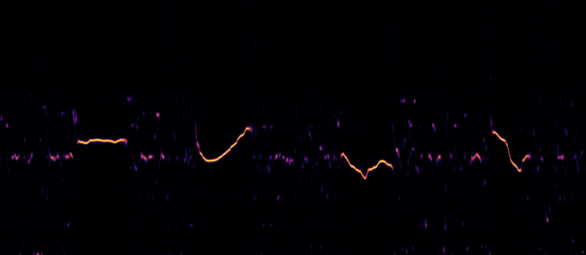

# Introduction

A Mandarin pitch detector for audio.

# Prerequisites
- Python v3.12.11
- poetry v2.1.3

## Environment Setup
The required environment can be installed by running `poetry install`. It automatically create a virtual environment under the `/.venv` folder with all required python dependencies.
